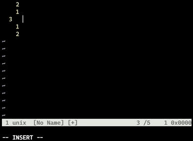

# coc-github-users

An extension for [coc.nvim](https://github.com/neoclide/coc.nvim) that provides
completions for GitHub usernames.

This is useful when writing git commit messages or when using [hub
pull-request](https://hub.github.com/) to create a PR.

Allows you to search for users either by their username or real name.



## Installation

1. Add the extension to coc.nvim:

   ```
   :CocInstall coc-github-users
   ```

2. Create a GitHub personal access token so the extension can access the GitHub
   API.
   1. Go to the [GitHub tokens page](https://github.com/settings/tokens)
   2. Click the `Generate new token` button
   3. Give the token a sensible name, e.g. `coc-github-users`
   4. The token doesn't need any scopes
   5. Click `Generate token` at the bottom of the page

3. Either export the token as environment variable `COC_GITHUB_USERS_TOKEN`, or
   add it to your coc.nvim config (`:CocConfig`) with key
   `coc.githubUsers.githubAccessToken`.

## How to use

Typing `@` followed by 2 or more characters will trigger the extension. For
example, if you type `@cb3`, you will get a list of autocomplete items for
usernames starting with `@cb3`, including my username `@cb372`.

For users who have added their real name to their GitHub profile, you will see
both their username and real name in the autocomplete item label.

You can search by real name by separating the names with underscores. For
example, if you type `@chris_birchall` you will also get you an autocomplete
list containing my username `@cb372`.

## Github Enterprise support

If you have an internal GitHub enterprise installation at work, you can configure it like so:

```json
{
  "coc.githubUsers.graphqlApiUrl": "http://your.internal.github.company.com/api/graphql",
  "coc.githubUsers.unixSocket": "/optional/path/to/unix.sock"
}
```

The `unixSocket` is optional, but useful if your company proxies all internal traffic through a local socket.

If you prefer ENV variables, you can configure:

* `COC_GITHUB_USERS_GRAPHQL_API_URL`
* `COC_GITHUB_USERS_UNIX_SOCKET`

in your shell environment instead.
